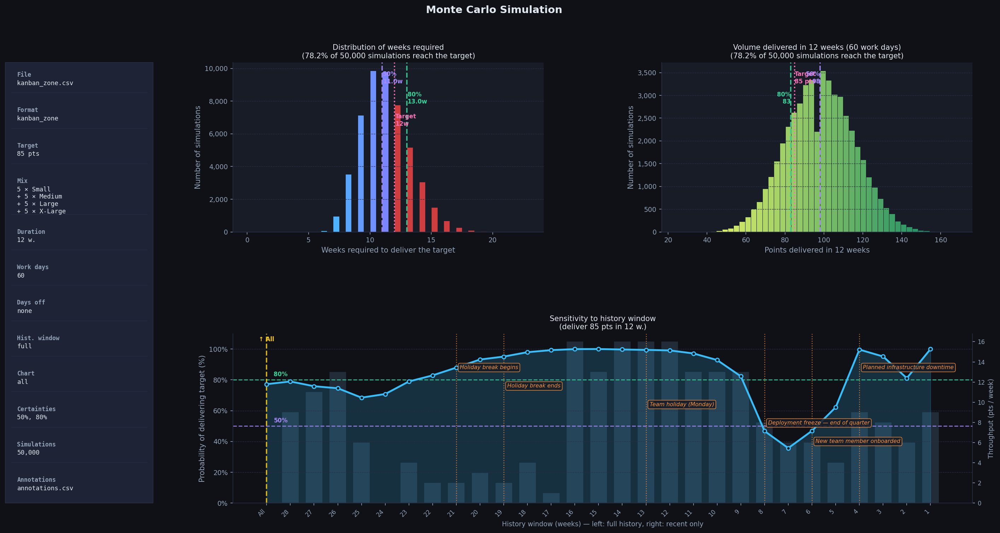

# Monte Carlo — Delivery Forecasting

Command-line tool for estimating the probability of delivering a set of work items within a given timeframe, using Monte Carlo simulation driven by the team's historical throughput.

> This script and its documentation were generated with the assistance of a generative artificial intelligence and reviewed by a human.

---

## Requirements

- Python 3.10 or later
- pip

## Installation

```bash
pip install -r requirements.txt
```

## Running tests

```bash
pip install -r requirements-dev.txt
python -m pytest
```

The suite covers the pure-logic modules (`dates`, `loaders`, `annotations`, `simulation`) with unit tests, and `charts`/`cli` with lighter smoke tests that render a real chart and drive `main()` end-to-end. It includes regression tests for two bugs found in earlier reviews: zero-throughput weeks being silently dropped at history-window boundaries, and `simulate()` hanging forever on an all-zero sample pool.

---

## Quick start

```bash
# From a Kanban Zone export: deliver 2 Large + 3 Medium in 10 weeks
python monte_carlo.py -l 2 -m 3 -w 10

# Same, history window limited to the last 12 weeks
python monte_carlo.py -l 2 -m 3 -w 10 -W 12

# 42 direct points, 15 weeks, 5 days off, certainties at 80% and 90%, French chart
python monte_carlo.py -p 42 -w 15 -v 5 -c 80 90 --lang fr

# Same idea, but expressed as a delivery deadline instead of a week count
python monte_carlo.py -p 42 -e 2026-12-15 -v 5 -c 80 90 --lang fr

# List supported formats
python monte_carlo.py --formats
```

The chart is saved in the `output/` directory as `monte_carlo_YYYYMMDD_HHMMSS.png` (override the directory with `-o/--output-dir`, the `monte_carlo` prefix with `-P/--output-prefix`).



---

## Option reference

| Short | Long              | Default       | Description |
|:---:|---|:---:|---|
| `-f` | `--file`          | auto-detect   | Data file (CSV or TXT); not used with `--board` |
|      | `--board`         | none          | Fetch cards from this Kanban Zone board's publicId instead of a file (see below) |
|      | `--api-key`       | none          | API key for `--board` (prefer the `KANBAN_ZONE_API_KEY` env var) |
|      | `--include-archived` | off        | With `--board`, also fetch archived cards |
|      | `--include-todo`  | off           | Add committed, queued-to-start cards (Kanban Zone's `Start` column state — not `Backlog`) to the target, computed from the board itself. Requires `--board` (see below) |
|      | `--include-wip`   | off           | Add in-progress cards (`In Progress`/`Buffer` column states, i.e. WIP) to the target, computed from the board itself. Requires `--board` (see below) |
| `-U` | `--uniform-size`  | none          | Count every completed card as this many points instead of reading `CF Size`/`CF Envergure` — for boards with no size field (see below) |
| `-w` | `--weeks`         | *(required)*  | Simulation duration in weeks (or use `-e`) |
| `-e` | `--target-date`   | none          | Target delivery date (`YYYY-MM-DD`) instead of `-w`; weeks = ceil((target − start) / 7 days) |
| `-W` | `--window`        | all           | Most recent N history weeks to use |
|      | `--window-start`  | none          | First completion date included in history (`YYYY-MM-DD`; not with `-W`). Without `--window-end`, runs through the latest available date |
|      | `--window-end`    | none          | Last completion date included in history (`YYYY-MM-DD`; not with `-W`). Without `--window-start`, starts from the earliest available date |
| `-G` | `--chart-weeks`   | `26`          | Weeks shown in the sensitivity chart (0 = all) |
| `-t` | `--tiny`          | `0`           | Number of *X-Small* items (0.5 pt) |
| `-s` | `--small`         | `0`           | Number of *Small* items (1 pt) |
| `-m` | `--medium`        | `0`           | Number of *Medium* items (3 pts) |
| `-l` | `--large`         | `0`           | Number of *Large* items (5 pts) |
| `-x` | `--xlarge`        | `0`           | Number of *X-Large* items (8 pts) |
| `-p` | `--points`        | `0`           | Extra points added directly to the target |
| `-d` | `--start-date`    | next Monday   | Simulation start date (format: `YYYY-MM-DD`) |
| `-v` | `--days-off`      | `0`           | Non-working days to subtract (vacation, sick leave, holidays…) |
| `-u` | `--unplanned-ratio` | `0`         | Fraction (0-1) of weekly throughput to discount for unplanned/ad hoc work (see below) |
| `-n` | `--simulations`   | `10000`       | Number of Monte Carlo simulations |
| `-c` | `--certainties`   | `80`          | Certainty levels to display (e.g. `-c 80 90 95`) |
| `-a` | `--annotations`   | auto-detect   | CSV annotations file (see below) |
| `-o` | `--output-dir`    | `output`      | Directory for generated charts |
| `-P` | `--output-prefix` | `monte_carlo` | Filename prefix for the generated chart (defaults to the config file's own name with `--configs`) |
|      | `--filename-format` | see below   | Template for the generated chart's filename, without extension (see below) |
|      | `--configs`       | none          | Run each of these `@`config files as a separate simulation in one invocation (see below) |
|      | `--lang`          | `en`          | Chart language: `en` or `fr` |
| `-T` | `--title`         | language default | Custom chart title |
| `-D` | `--description`   | none          | Optional subtitle shown below the chart title |
|      | `--formats`       |               | List supported formats and exit |

### Item sizes and point values

| Size       | French (Kanban Zone) | Points |
|:---:|:---:|:---:|
| X-Small    | Très petit | 0.5 |
| Small      | Petit      | 1   |
| Medium     | Moyen      | 3   |
| Large      | Grand      | 5   |
| X-Large    | Très grand | 8   |

Both columns are accepted wherever an item size is read from a data file (`CF Size`/`CF Envergure` values) — see `ALL_SCORES` in `montecarlo/constants.py`.

### Chart filename

By default the generated chart's filename summarizes the run:

```
monte_carlo_2026-11-23_5pts_100pct_20260922_095207.png
 prefix     date        target prob  timestamp
```

The timestamp is always kept last so a plain directory listing still sorts repeated runs chronologically. Override the whole scheme with `--filename-format`, using any of these placeholders (all support [Python format specs](https://docs.python.org/3/library/string.html#format-specification-mini-language), e.g. `{target:.0f}` or `{timestamp:%Y%m%d}`):

| Placeholder | Value |
|---|---|
| `{prefix}` | `-P/--output-prefix` |
| `{date}` | Target delivery date (`-e/--target-date`, or start date + `-w/--weeks` when no target date is given) |
| `{target}` | Target volume (points) |
| `{prob}` | Probability (%) of delivering the target within the simulated duration |
| `{timestamp}` | Chart generation time |
| `{weeks}` | Simulation duration in weeks |
| `{simulations}` | Number of Monte Carlo simulations (`-n`) |

```
--filename-format "{timestamp:%Y%m%d_%H%M%S}_{weeks}w_{simulations}sims"
```

---

## Reusing options with a config file

If you run forecasts for the same scope repeatedly — updating only the data file and the time remaining — save the recurring flags in a file and reuse it:

```bash
python monte_carlo.py @data/run.conf
```

One flag per line (`-m 5`, `--lang fr`, …), same names as `--help`. Blank lines and lines starting with `#` are ignored. Values with spaces need quotes, same as on a command line — this includes a file path that lives under a folder with spaces (e.g. a OneDrive path: `-f "C:\OneDrive - Company\data\kanban_zone.csv"`); unlike a real command line, backslashes in paths are kept as-is.

Add more flags after `@data/run.conf` on the command line to override just those for one run (e.g. `python monte_carlo.py @data/run.conf -w 4`).

**Example file:** `exemples/run.conf` — copy it to `data/run.conf` (gitignored) as a starting point for your own team. Pairing it with `-e/--target-date` means the file rarely needs editing: only the scope (`-t/-s/-m/-l/-x/-p`) and the deadline change as the plan evolves, and "weeks remaining" is recalculated automatically from today every time you run it.

### Running several configs at once

If you track more than one team or board, `--configs` runs each file as its own separate simulation and chart in a single command:

```bash
python monte_carlo.py --configs data/team_a.conf data/team_b.conf --lang fr -n 20000
```

Flags placed after the file list (`--lang fr -n 20000` above) are shared across every run, letting each config file hold only what's specific to that team while common settings live on the command line. Each run's chart is named after its own config file (`team_a_YYYYMMDD_HHMMSS.png`, `team_b_...`) unless `-P/--output-prefix` is given explicitly, in which case every run uses that same prefix instead.

---

## Supported data formats

### Kanban Zone CSV

Native export from [Kanban Zone](https://kanbanzone.com/). Required columns:

| Column                          | Description |
|---|---|
| `Done At`                       | Completion date, format `MM-DD-YYYY HH:MM` or `MM/DD/YYYY hh:mm AM/PM` |
| `CF Size` or `CF Envergure`     | Item size: `X-Small`/`Très petit`, `Small`/`Petit`, `Medium`/`Moyen`, `Large`/`Grand`, or `X-Large`/`Très grand` |

Custom field names are set per-board, so English names are accepted, along with the French names this project's own team's board uses — for both the column name and the size value inside it (see [Item sizes and point values](#item-sizes-and-point-values)). All other export columns are ignored. Detection is automatic: if `Done At` and one of the size column names are present in the header row, the file is recognized as a Kanban Zone export.

Calendar weeks with no completions between the first and last delivered item count as 0 pts of throughput — they are not skipped. Omitting them would silently inflate the average throughput and destabilize the sensitivity chart's small history windows.

If an optional `CF Exception` (or `CF Prioritaire`) column is present, cards flagged `true` are excluded from throughput entirely. These are Kanban Zone's exceptions that bypass the normal planning process (ad hoc / unplanned work) — since the simulation's target is built only from planned items, counting historical ad hoc work would overstate how much capacity is actually available for what you're forecasting.

**Example file:** `exemples/kanban_zone.csv`

```bash
python monte_carlo.py -f exemples/kanban_zone.csv -w 12 -l 3 -m 4
```

#### Boards with no size field

Some boards don't categorize cards by size at all — every completed card is worth the same. Use `-U/--uniform-size` to count every completed card as a fixed number of points, ignoring `CF Size`/`CF Envergure` entirely:

```bash
python monte_carlo.py -f data/no_size_board.csv -U 1 -p 20 -w 8
```

This also forces detection of the file as a Kanban Zone export even though it has no size column, since `Done At` alone is otherwise not a reliable enough signal.

---

### Kanban Zone API (live fetch)

Instead of exporting a CSV by hand, fetch cards directly from a board:

```bash
python monte_carlo.py --board <boardPublicId> -w 12 -l 3 -m 4
```

| Option | Default | Description |
|---|:---:|---|
| `--board` | none | The board's public ID (from its URL, e.g. `kanbanzone.io/b/<publicId>`) |
| `--api-key` | none | API key. **Prefer the `KANBAN_ZONE_API_KEY` environment variable instead** — this flag ends up in shell history and, if used in a config file, in a plaintext file on disk |
| `--include-archived` | off (active cards only) | Also fetch archived cards |

`--board` cannot be combined with `-f/--file`. Cards are converted to the same shape as a CSV export (`Done At`, `CF <label>` per custom field — the API's field labels have no `CF ` prefix; it's added back here to match the CSV column-naming convention) and written to a temporary file for the duration of the run, so the exact same parsing, zero-week-filling, and `CF Exception`/`CF Prioritaire` exclusion logic applies either way.

**If your team archives cards once they're done** (common — check by comparing throughput with and without `--include-archived`), the active-only default will undercount historical throughput significantly, since most completed work is no longer "active". `--include-archived` is worth using by default in that case.

Requires an [API key](https://kanbanzone.com/2019/integrate-with-kanban-zones-api-to-create-cards/) from Organization Settings → API Key. This integration is built against observed API responses rather than Kanban Zone's own (JavaScript-rendered) developer docs — if a field name has changed, `montecarlo/kanbanzone_api.py` raises a clear error rather than silently producing wrong numbers.

#### Deriving the target from the board itself

Instead of entering the scope by hand (`-t/-s/-m/-l/-x/-p`), `--include-todo` and `--include-wip` sum the point value of cards currently on the board, using each card's own `CF Size`/`CF Envergure` value (or `-U/--uniform-size`, for a board with no size field):

```bash
python monte_carlo.py --board <boardPublicId> --include-todo --include-wip -w 8
```

- `--include-todo` — cards committed and queued to start soon (Kanban Zone's normalized `Start` column state; not `Backlog`, which is an uncommitted, not-yet-scheduled pool and is deliberately excluded)
- `--include-wip` — cards already in progress (`In Progress`/`Buffer` column states, together forming WIP)

Use either one alone to forecast just that slice of work (e.g. "how long to clear what's already in progress"), or both together for the full remaining scope. Both add to, rather than replace, any manually-specified `-t/-s/-m/-l/-x/-p`/`-p`. A card whose column state doesn't match either option (e.g. `Done`, `Archive`) is never counted, and a card that's been archived is always excluded from both, regardless of the column it's sitting in — `--include-archived` widens historical throughput to completed-but-archived cards, it doesn't mean an archived (e.g. cancelled) card should still count as scope. A matching card with no readable size is skipped and reported as a warning, the same way an unsized card is skipped from throughput.

These column states are Kanban Zone's own normalization, independent of each column's actual (freeform, per-board, possibly translated) title — confirmed by inspecting two real boards with very different column setups.

---

### Plain-text throughput file

Simple format: comma-separated numeric values on a single line, ordered from oldest to most recent week. Each value represents the total points delivered in that week.

```
3, 8, 5, 6, 11, 4, 9, 13, 7, 5, 14, 8
```

Synthetic dates are assigned automatically, anchoring the last value to the Monday of the previous week.

This format has no per-card detail, so unplanned/ad hoc work can't be detected automatically the way it is for Kanban Zone's `CF Exception`/`CF Prioritaire` field — use `-u/--unplanned-ratio` to apply an equivalent manual discount.

**Example file:** `exemples/throughput.txt`

```bash
python monte_carlo.py -f exemples/throughput.txt -w 10 -p 30
```

---

## Annotations file

Annotations let you mark events visually on the sensitivity chart (collective holidays, deployment freezes, team member changes, etc.).

**Format:** CSV with two columns, `Date` and `Note`.

```csv
Date,Note
2025-12-22,Holiday break begins
2026-01-05,Holiday break ends
2026-03-20,Deployment freeze — end of quarter
```

Accepted date formats: `YYYY-MM-DD`, `YYYY/MM/DD`, `MM-DD-YYYY HH:MM`, or `MM/DD/YYYY hh:mm AM/PM`.

**Example file:** `exemples/annotations.csv`

By default, the script automatically loads `data/annotations.csv` if present. To specify a different file:

```bash
python monte_carlo.py -f my_export.csv -w 12 -l 2 -a my_annotations.csv
```

---

## Adding a new data format

The architecture uses a loader registry in `montecarlo/loaders.py`. To add support for a new format (e.g. Jira, Azure DevOps, Linear…):

**1. Create a subclass of `ThroughputLoader`** (in `montecarlo/loaders.py`, or your own module importing from it)

```python
from montecarlo.dates import parse_date
from montecarlo.loaders import ThroughputLoader

class JiraCSVLoader(ThroughputLoader):
    FORMAT_NAME = "jira"
    DESCRIPTION = "Jira CSV export (columns 'Resolved' and 'Story Points')"
    EXTENSIONS = [".csv"]
    _REQUIRED_COLS = {"Resolved", "Story Points"}

    def match(self, filepath: str) -> bool:
        # Header inspection avoids confusion with Kanban Zone exports
        if Path(filepath).suffix.lower() not in self.EXTENSIONS:
            return False
        try:
            with open(filepath, newline="", encoding="utf-8-sig") as f:
                headers = set(next(csv.reader(f)))
            return self._REQUIRED_COLS.issubset(headers)
        except Exception:
            return False

    def load(
        self,
        filepath: str,
        window_weeks: int | None,
        window_start: date | None = None,
        window_end: date | None = None,
    ) -> dict[date, float]:
        daily: dict[date, float] = defaultdict(float)
        with open(filepath, newline="", encoding="utf-8-sig") as f:
            reader = csv.DictReader(f)
            for row in reader:
                resolved   = row.get("Resolved", "").strip()
                points_raw = row.get("Story Points", "").strip()
                if not resolved or not points_raw:
                    continue
                d = parse_date(resolved)
                try:
                    pts = float(points_raw)
                except ValueError:
                    continue
                if d is not None:
                    daily[d] += pts
        # ... weekly aggregation + window filtering identical to KanbanZoneCSVLoader
        # (including _fill_zero_weeks — see montecarlo/loaders.py)
```

**2. Register the loader in `LOADERS`**

```python
LOADERS: list[ThroughputLoader] = [
    KanbanZoneCSVLoader(),
    TxtLoader(),
    JiraCSVLoader(),   # ← add here
]
```

The position in `LOADERS` determines priority in case of ambiguity. Header-based `match()` ensures that two distinct CSV dialects never conflict.

---

## Example files

| File                        | Format       | Usage |
|---|---|---|
| `exemples/kanban_zone.csv`  | Kanban Zone  | `-f exemples/kanban_zone.csv` |
| `exemples/throughput.txt`   | Plain text   | `-f exemples/throughput.txt` |
| `exemples/annotations.csv`  | Annotations  | `-a exemples/annotations.csv` |
| `exemples/run.conf`         | Config file  | `@exemples/run.conf` |

---

## Project structure

```
monte_carlo.py          Entry point — python monte_carlo.py [options]
montecarlo/              Implementation package
    constants.py         Scoring, default paths, accepted date formats
    strings.py            Chart text tables (en/fr) — CHART_STRINGS
    dates.py              Date parsing helpers
    loaders.py             Loader registry (ThroughputLoader, LOADERS) — see "Adding a new data format"
    kanbanzone_api.py       Live Kanban Zone API fetch (--board), adapted into a CSV loaders.py reads
    annotations.py         Annotations CSV loading
    simulation.py           Core Monte Carlo simulation
    theme.py                Chart colour palette
    charts.py                Chart rendering (make_charts and its sub-charts)
    cli.py                   Argument parsing and main()
tests/                  Pytest suite (see "Running tests")
requirements.txt        Python dependencies
requirements-dev.txt    Adds pytest, for running tests
pytest.ini              Pytest configuration
README.md               This documentation
.gitignore
data/                   Input data (gitignored — place your files here)
    kanban_zone.csv
    annotations.csv
    Throughput.txt
    run.conf              Your own reusable options (see "Reusing options with a config file")
output/                 Generated charts (gitignored)
exemples/               Committed sample files
    kanban_zone.csv
    throughput.txt
    annotations.csv
    run.conf
```
